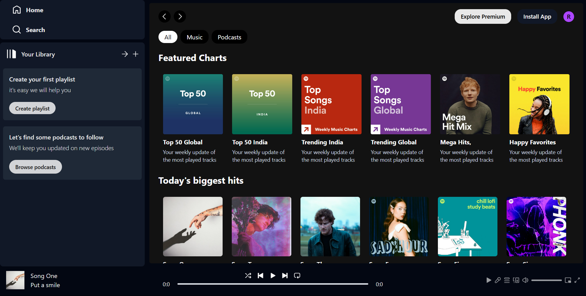
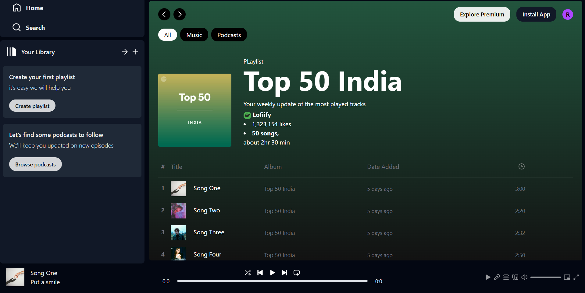
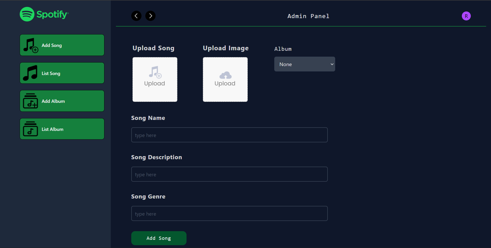
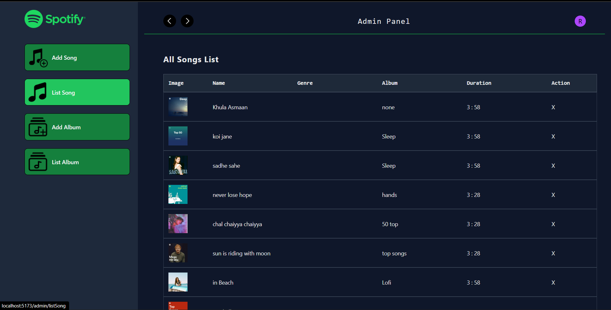

## 🎵 Lofify — Spotify Clone 

Lofify is a **full-stack music streaming application** inspired by Spotify.  
It includes both a **user-friendly music player** and an **admin panel** to manage songs and albums.  
Built with **React.js, Tailwind CSS** for the frontend and **Node.js, Express.js, MongoDB** for the backend.

---
https://github.com/rou-nak-cloud/Lofiify/blob/main/Client/screenshots/AdminPanel.png
## 📸 Preview

| Desktop View | Banner View |
|--------------|-------------|
|  |  |

| Admin Panel | List Song |
|--------------|-------------|
|  |  |

---

## 🚀 Features

### **🎧 User Side**
- Play songs with a sleek **Spotify-like UI**
- View featured charts & playlists
- Browse and play from available albums
- Responsive music player with **play/pause/next/previous**
- Fully responsive design for desktop & mobile

### **🛠 Admin Side**
- Add new **songs** with details (title, artist, album, cover image, audio file)
- Add new **albums** with cover image and description
- List and manage songs/albums in an intuitive dashboard
- Upload files directly (images & audio)

---

## 🚀 Getting Started

### 1️⃣ Clone the Repository
```bash
git clone https://github.com/your-username/lofify.git
cd lofify

npm install
npm run dev

Then open http://localhost:5173 in your browser.
```

##.env File
```
PORT=5000
MONGO_URI=your_mongodb_connection_string
CLOUDINARY_CLOUD_NAME=your_cloudinary_name
CLOUDINARY_API_KEY=your_cloudinary_api_key
CLOUDINARY_API_SECRET=your_cloudinary_api_secret

VITE_BACKEND_URL=http://localhost:5000
---
```

| Made by Rounak Bakshi 💙 |


